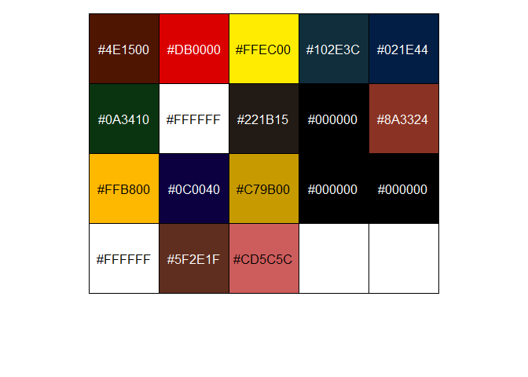
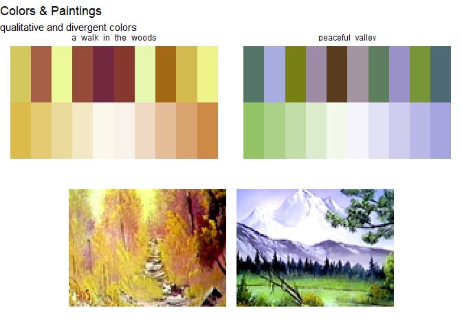
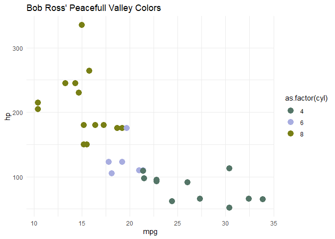

bob_ross_colors
================
fth

``` r
# devtools::install_github("frankiethull/BobRossColors")
library(ggplot2)
library(dplyr)
library(tidyr)
library(BobRossColors)
```

## Bob Ross Colors

Bob Ross colors were programmatically created using a curated list of
all bob ross’ paintings.

The BobRossColors::bob_ross_paintings initially came from
jwilber/Bob_Ross_Paintings, and the palettes under
BobRossColors::all_palettes leveraged imgpalr to mine divergent and
qualitative colors from each painting image. In addition, unique Bob
Ross named colors are in the package as well.

The package includes: the three data mentioned above, and three helper
functions to effortlessly add Bob Ross style to your data
visualizations.

### EDA of palettes:

There are two datasets of color information, the unblended bob ross
named colors, and the blended colors extracted from each painting.

Here are the unique named colors, note that there are multiple white and
black hexes under different names. (e.g. MidnightBlack, LiquidBlack, &
BlackGesso)

``` r
print(unique_bob_ross_colors)
```

                 color color_hex
    1  AlizarinCrimson   #4E1500
    2        BrightRed   #DB0000
    3    CadmiumYellow   #FFEC00
    4     PhthaloGreen   #102E3C
    5     PrussianBlue   #021E44
    6         SapGreen   #0A3410
    7    TitaniumWhite   #FFFFFF
    8     VanDykeBrown   #221B15
    9       BlackGesso   #000000
    10      BurntUmber   #8A3324
    11    IndianYellow   #FFB800
    12     PhthaloBlue   #0C0040
    13     YellowOchre   #C79B00
    14     LiquidBlack   #000000
    15   MidnightBlack   #000000
    16     LiquidClear   #FFFFFF
    17      DarkSienna   #5F2E1F
    18       IndianRed   #CD5C5C

One thing that allows easy viewing of colors is scales::show_col(). Here
are the named colors Bob Ross used across all 403 paintings in the
dataset.

``` r
scales::show_col(unique_bob_ross_colors$color_hex)
```



scales::showcol() works well, but for the large amount of palettes this
package contains, there is a helper function within the package to use.
Not only does the function show the palette, but the paintings as well.

``` r
show_colors_and_paintings()
```



### ggplot2 use cases

scale_color_bob_ross() & scale_fill_bob_ross() are designed for easy use
with the ggplot2 library. Here are a few examples using these functions
and their arguments.

``` r
mtcars |>
  ggplot() + 
  geom_point(aes(x = mpg, y = hp, color = as.factor(cyl)), size = 4) + 
  theme_minimal() + 
  scale_color_bob_ross(painting = "peaceful_valley", type = "qualitative") + 
  labs(title = "Bob Ross' Peacefull Valley Colors")
```



There are two types of palettes, across 403 paintings. 806 options! So
plenty of perusing, & these colors were blended by a painter, not a data
vizzer, so most should be appealing to the eye.

Painting names are snake_case for ease of use. Listed below as
reference:

``` r
all_palettes |>
  select(painting_title) |>
  unique() |>
  pull()
```

      [1] "a_walk_in_the_woods"         "mt_mckinley"                
      [3] "ebony_sunset"                "winter_mist"                
      [5] "quiet_stream"                "winter_moon"                
      [7] "autumn_mountain"             "peaceful_valley"            
      [9] "seascape"                    "mountain_lake"              
     [11] "winter_glow"                 "snow_fall"                  
     [13] "final_reflections"           "meadow_lake"                
     [15] "winter_sun"                  "ebony_sea"                  
     [17] "shades_of_grey"              "autumn_splendor"            
     [19] "black_river"                 "brown_mountain"             
     [21] "reflections"                 "black_and_white_seascape"   
     [23] "lazy_river"                  "black_waterfall"            
     [25] "mountain_waterfall"          "final_grace"                
     [27] "mountain_retreat"            "blue_moon"                  
     [29] "bubbling_stream"             "winter_night"               
     [31] "distant_hills"               "covered_bridge"             
     [33] "quiet_inlet"                 "night_light"                
     [35] "the_old_mill"                "campfire"                   
     [37] "rustic_barn"                 "hidden_lake"                
     [39] "peaceful_waters"             "purple_splendor"            
     [41] "tranquil_valley"             "majestic_mountains"         
     [43] "winter_sawscape"             "evening_seascape"           
     [45] "warm_summer_day"             "cabin_in_the_woods"         
     [47] "wetlands"                    "cool_waters"                
     [49] "quiet_woods"                 "northwest_majesty"          
     [51] "autumn_days"                 "mountain_challenge"         
     [53] "twilight_meadow"             "mountain_blossoms"          
     [55] "winter_stillness"            "quiet_pond"                 
     [57] "ocean_sunrise"               "bubbling_brook"             
     [59] "arizona_splendor"            "anatomy_of_a_wave"          
     [61] "the_windmill"                "autumn_glory"               
     [63] "indian_girl"                 "meadow_stream"              
     [65] "blue_river"                  "natures_edge"               
     [67] "morning_mist"                "whispering_stream"          
     [69] "secluded_forest"             "snow_trail"                 
     [71] "arctic_beauty"               "horizons_west"              
     [73] "high_chateau"                "country_life"               
     [75] "western_expanse"             "marshlands"                 
     [77] "blaze_of_color"              "winter_cabin"               
     [79] "secluded_lake"               "evergreens_at_sunset"       
     [81] "mountain_cabin"              "portrait_of_sally"          
     [83] "misty_waterfall"             "barn_at_sunset"             
     [85] "mountain_splendor"           "lake_by_mountain"           
     [87] "mountain_glory"              "grey_winter"                
     [89] "dock_scene"                  "dark_waterfall"             
     [91] "misty_rolling_hills"         "lakeside_cabin"             
     [93] "warm_winter_day"             "waterside_way"              
     [95] "hunters_haven"               "bubbling_mountain_brook"    
     [97] "winter_hideaway"             "foot_of_the_mountain"       
     [99] "majestic_pine"               "cactus_at_sunset"           
    [101] "mountain_range"              "lonely_retreat"             
    [103] "northern_lights"             "winter_evergreens"          
    [105] "surfs_up"                    "red_sunset"                 
    [107] "meadow_road"                 "winter_oval"                
    [109] "secluded_beach"              "forest_hills"               
    [111] "little_house_by_the_road"    "mountain_path"              
    [113] "country_charm"               "natures_paradise"           
    [115] "mountain_by_the_sea"         "mountain_hideaway"          
    [117] "towering_peaks"              "cabin_at_sunset"            
    [119] "twin_falls"                  "secluded_bridge"            
    [121] "ocean_breeze"                "autumn_woods"               
    [123] "winter_solitude"             "golden_sunset"              
    [125] "mountain_oval"               "ocean_sunset"               
    [127] "triple_view"                 "winter_frost"               
    [129] "mountain_stream"             "country_cabin"              
    [131] "daisy_delight"               "hidden_stream"              
    [133] "towering_glacier"            "oval_barn"                  
    [135] "lakeside_path"               "sunset_oval"                
    [137] "winter_barn"                 "sunset_over_the_waves"      
    [139] "golden_glow"                 "roadside_barn"              
    [141] "happy_accident"              "golden_knoll"               
    [143] "mountain_reflections"        "secluded_mountain"          
    [145] "bright_autumn_trees"         "black_seascape"             
    [147] "steep_mountains"             "quiet_mountains_river"      
    [149] "evening_waterfall"           "tropical_seascape"          
    [151] "mountain_at_sunset"          "soft_mountain_glow"         
    [153] "mountain_in_an_oval"         "winter_mountain"            
    [155] "rolling_hills"               "frozen_solitude"            
    [157] "meadow_brook"                "evening_at_sunset"          
    [159] "mountain_view"               "hidden_creek"               
    [161] "peaceful_haven"              "mountain_exhibition"        
    [163] "emerald_waters"              "mountain_summit"            
    [165] "cabin_hideaway"              "oval_essence"               
    [167] "lost_lake"                   "distant_mountains"          
    [169] "meadow_brook_surprise"       "mountain_moonlight_oval"    
    [171] "snowy_solitude"              "mountain_river"             
    [173] "graceful_mountains"          "windy_waves"                
    [175] "on_a_clear_day"              "riverside_escape_oval"      
    [177] "surprising_falls"            "shadow_pond"                
    [179] "misty_forest_oval"           "natural_wonder"             
    [181] "splendor_of_winter"          "colors_of_nature"           
    [183] "grandpas_barn"               "peaceful_reflections"       
    [185] "hidden_winter_moon_oval"     "waves_of_wonder"            
    [187] "cabin_by_the_pond"           "fall_stream"                
    [189] "christmas_eve_snow"          "forest_down_oval"           
    [191] "pathway_to_autumn"           "deep_forest_lake"           
    [193] "peaks_of_majesty"            "two_seasons"                
    [195] "nestled_cabin"               "wintertime_discovery"       
    [197] "mountain_mirage_wood_shape"  "double_oval_fantasy"        
    [199] "contemplative_lady"          "deep_woods"                 
    [201] "high_tide"                   "barn_in_snow_oval"          
    [203] "that_time_of_year"           "waterfall_wonder"           
    [205] "mighty_mountain_lake"        "wooded_stream_oval"         
    [207] "golden_mist_oval"            "the_old_home_place"         
    [209] "soothing_vista"              "stormy_seas"                
    [211] "country_time"                "a_mild_winters_day"         
    [213] "spectacular_waterfall"       "view_from_the_park"         
    [215] "lake_view"                   "old_country_mill"           
    [217] "morning_walk"                "natures_splendor"           
    [219] "mountain_beauty"             "half_oval_vignette"         
    [221] "absolutely_autumn"           "mountain_seclusion"         
    [223] "crimson_oval"                "autumn_exhibition"          
    [225] "majestic_peaks"              "golden_morning_mist"        
    [227] "winter_lace"                 "seascape_fantasy"           
    [229] "double_oval_stream"          "enchanted_forest"           
    [231] "southwest_serenity"          "rippling_waters"            
    [233] "snowfall_magic"              "quiet_mountain_lake"        
    [235] "final_embers_of_sunlight"    "snowy_morn"                 
    [237] "campers_haven"               "waterfall_in_the_woods"     
    [239] "covered_bridge_oval"         "scenic_seclusion"           
    [241] "ebb_tide"                    "after_the_rain"             
    [243] "winter_elegance"             "evenings_peace"             
    [245] "valley_of_tranquility"       "mystic_mountain"            
    [247] "new_days_dawn"               "winter_in_pastel"           
    [249] "hazy_day"                    "divine_elegance"            
    [251] "cliffside"                   "autumn_fantasy"             
    [253] "the_old_oak_tree"            "winter_paradise"            
    [255] "days_gone_by"                "change_of_seasons"          
    [257] "hidden_delight"              "double_take"                
    [259] "valley_view"                 "tranquil_dawn"              
    [261] "royal_majesty"               "serenity"                   
    [263] "cabin_at_trails_end"         "mountain_rhapsody"          
    [265] "wilderness_cabin"            "by_the_sea"                 
    [267] "indian_summer"               "blue_winter"                
    [269] "desert_glow"                 "lone_mountain"              
    [271] "floridas_glory"              "autumn_images"              
    [273] "hint_of_springtime"          "around_the_bend"            
    [275] "countryside_oval"            "russet_winter"              
    [277] "purple_haze"                 "dimensions"                 
    [279] "deep_wilderness_home"        "haven_in_the_valley"        
    [281] "wintertime_blues"            "pastel_seascape"            
    [283] "country_creek"               "silent_forest"              
    [285] "frosty_winter_morn"          "forest_edge"                
    [287] "mountain_ridge_lake"         "reflections_of_gold"        
    [289] "quiet_cove"                  "rivers_peace"               
    [291] "at_dawns_light"              "valley_waterfall"           
    [293] "toward_days_end"             "falls_in_the_glen"          
    [295] "frozen_beauty_in_vignette"   "crimson_tide"               
    [297] "winter_bliss"                "gray_mountain"              
    [299] "wayside_pond"                "teton_winter"               
    [301] "little_home_in_the_meadow"   "a_pretty_autumn_day"        
    [303] "mirrored_images"             "back_country_path"          
    [305] "graceful_waterfall"          "icy_lake"                   
    [307] "rowboat_on_the_beach"        "portrait_of_winter"         
    [309] "the_footbridge"              "snowbound_cabin"            
    [311] "hide_a_way_cove"             "enchanted_falls_oval"       
    [313] "not_quite_spring"            "splashes_of_autumn"         
    [315] "summer_in_the_mountain"      "oriental_falls"             
    [317] "autumn_palette"              "cypress_swamp"              
    [319] "downstream_view"             "just_before_the_storm"      
    [321] "fishermans_paradise"         "desert_hues"                
    [323] "the_property_line"           "in_the_stillness_of_morning"
    [325] "delightful_meadow_home"      "first_snow"                 
    [327] "lake_in_the_valley"          "a_trace_of_spring"          
    [329] "an_arctic_winter_day"        "snow_birch"                 
    [331] "early_autumn"                "tranquil_wooded_stream"     
    [333] "purple_mountain_range"       "storms_a_comin"             
    [335] "sunset_aglow"                "evening_at_the_falls"       
    [337] "twilight_beauty"             "anglers_haven"              
    [339] "rustic_winter_woods"         "wilderness_falls"           
    [341] "winter_at_the_farm"          "daisies_at_dawn"            
    [343] "a_spectacular_view"          "daybreak"                   
    [345] "island_paradise"             "sunlight_in_the_shadows"    
    [347] "splendor_of_a_snowy_winter"  "forest_river"               
    [349] "golden_glow_of_morning"      "fishermans_trail"           
    [351] "a_warm_winter"               "under_pastel_skies"         
    [353] "golden_rays_of_sunshine"     "the_magic_of_fall"          
    [355] "glacier_lake"                "the_old_weathered_barn"     
    [357] "deep_forest_falls"           "winters_grace"              
    [359] "splendor_of_autumn"          "tranquil_seas"              
    [361] "mountain_serenity"           "home_before_nightfall"      
    [363] "island_in_the_wilderness"    "autumn_oval"                
    [365] "seasonal_progression"        "light_at_the_summit"        
    [367] "countryside_barn"            "mountain_lake_falls"        
    [369] "cypress_creek"               "trappers_cabin"             
    [371] "storm_on_the_horizon"        "pot_o_posies"               
    [373] "a_perfect_winter_day"        "auroras_dance"              
    [375] "woodmans_retreat"            "babbling_brook"             
    [377] "woodgrain_view"              "winters_peace"              
    [379] "wilderness_trail"            "a_copper_winter"            
    [381] "misty_foothills"             "through_the_window"         
    [383] "home_in_the_valley"          "mountains_of_grace"         
    [385] "seaside_harmony"             "a_cold_spring_day"          
    [387] "evenings_glow"               "blue_ridge_falls"           
    [389] "reflections_of_calm"         "before_the_snowfall"        
    [391] "winding_stream"              "tranquility_cove"           
    [393] "cabin_in_the_hollow"         "view_from_clear_creek"      
    [395] "bridge_to_autumn"            "trails_end"                 
    [397] "evergreen_valley"            "balmy_beach"                
    [399] "lake_at_the_ridge"           "in_the_midst_of_winter"     
    [401] "wilderness_day"             
